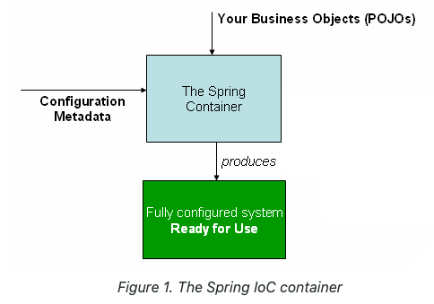

# Inversion of Control(IoC) container

`org.springframework.context`, `org.springframework.beans`

BeanFactory
> Provides an advanced configuration mechanism capable of managing any type of object
> - Provides the configuration framework and basic functionality.

ApplicationContext
> Sub-interface of BeanFactory. It adds:
> - Easier integration with Spring's AOP features.
> - Message resource handling. (for use in internationalization)
> - Event publication.
> - Application-layer specific contexts such as `WebApplicationContext`for use web applications.

## Container Overview

`org.springframework.context.ApplicationContext` 는 Spring IoC Container로
Configuration metadata를 읽어 인스턴트화, 설정, 빈 모으는 역할을 한다.



### Container Metadata
Configuration metadata는 어플리케이션 개발자가 Spring container로 설정해야 하는 부분이다.
* `Annotation-based configuration`: 어플레케이션 Component 클래스에 어노테이션 설정을 이용해 정의한 빈  
* `Java-based configuration`: `@Configuration`, `@Bean`, `@Import`, `@DependsOn` 어노테이션을 이용하여 어플리케이션 외부에 정의한 빈 

```java
public interface ApplicationContext extends EnvironmentCapable, ListableBeanFactory, HierarchicalBeanFactory,
        MessageSource, ApplicationEventPublisher, ResourcePatternResolver {

    /**
     * Return the unique id of this application context.
     * @return the unique id of the context, or {@code null} if none
     */
    @Nullable
    String getId();

    /**
     * Return a name for the deployed application that this context belongs to.
     * @return a name for the deployed application, or the empty String by default
     */
    String getApplicationName();

    /**
     * Return a friendly name for this context.
     * @return a display name for this context (never {@code null})
     */
    String getDisplayName();

    /**
     * Return the timestamp when this context was first loaded.
     * @return the timestamp (ms) when this context was first loaded
     */
    long getStartupDate();

    /**
     * Return the parent context, or {@code null} if there is no parent
     * and this is the root of the context hierarchy.
     * @return the parent context, or {@code null} if there is no parent
     */
    @Nullable
    ApplicationContext getParent();

    /**
     * Expose AutowireCapableBeanFactory functionality for this context.
     * <p>This is not typically used by application code, except for the purpose of
     * initializing bean instances that live outside the application context,
     * applying the Spring bean lifecycle (fully or partly) to them.
     * <p>Alternatively, the internal BeanFactory exposed by the
     * {@link ConfigurableApplicationContext} interface offers access to the
     * {@link AutowireCapableBeanFactory} interface too. The present method mainly
     * serves as a convenient, specific facility on the ApplicationContext interface.
     * <p><b>NOTE: As of 4.2, this method will consistently throw IllegalStateException
     * after the application context has been closed.</b> In current Spring Framework
     * versions, only refreshable application contexts behave that way; as of 4.2,
     * all application context implementations will be required to comply.
     * @return the AutowireCapableBeanFactory for this context
     * @throws IllegalStateException if the context does not support the
     * {@link AutowireCapableBeanFactory} interface, or does not hold an
     * autowire-capable bean factory yet (for example, if {@code refresh()} has
     * never been called), or if the context has been closed already
     * @see ConfigurableApplicationContext#refresh()
     * @see ConfigurableApplicationContext#getBeanFactory()
     */
    AutowireCapableBeanFactory getAutowireCapableBeanFactory() throws IllegalStateException;
}


public interface BeanFactory {
    String FACTORY_BEAN_PREFIX = "&";

    Object getBean(String name) throws BeansException;

    <T> T getBean(String name, Class<T> requiredType) throws BeansException;

    Object getBean(String name, Object... args) throws BeansException;

    <T> T getBean(Class<T> requiredType) throws BeansException;

    <T> T getBean(Class<T> requiredType, Object... args) throws BeansException;

    <T> ObjectProvider<T> getBeanProvider(Class<T> requiredType);

    <T> ObjectProvider<T> getBeanProvider(ResolvableType requiredType);

    boolean containsBean(String name);

    boolean isSingleton(String name) throws NoSuchBeanDefinitionException;

    boolean isPrototype(String name) throws NoSuchBeanDefinitionException;

    boolean isTypeMatch(String name, ResolvableType typeToMatch) throws NoSuchBeanDefinitionException;

    boolean isTypeMatch(String name, Class<?> typeToMatch) throws NoSuchBeanDefinitionException;

    @Nullable
    Class<?> getType(String name) throws NoSuchBeanDefinitionException;

    @Nullable
    Class<?> getType(String name, boolean allowFactoryBeanInit) throws NoSuchBeanDefinitionException;

    String[] getAliases(String name);
}
```