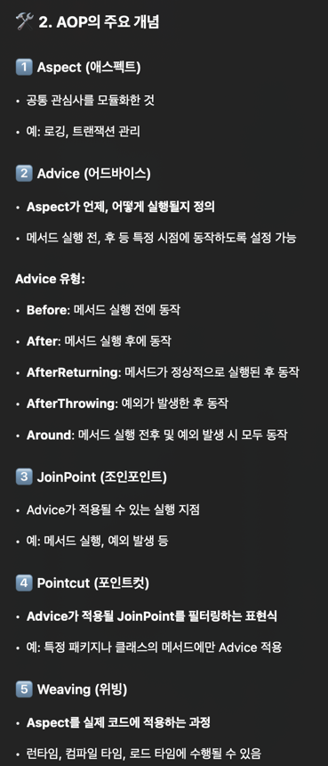
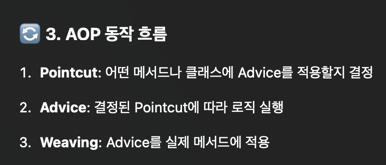

# AOP

AOP는 애플리케이션 로직에서 공통적으로 반복되거나 별도로 관리해야 하는 "횡단 관심사(Cross-Cutting Concerns)" 를 분리하여 코드 중복을 줄이고 유지보수성을 향상시키는 프로그래밍 패러다임입니다.
쉽게 말해, 여러 곳에 걸쳐 적용될 필요가 있지만 핵심 비즈니스 로직과 직접적으로 관련되지 않은 기능들을 모아 관리하는 방법이라고 생각하면 됩니다. 예를 들어 다음과 같습니다:

- 로깅: 모든 메서드 실행 전후 로그 기록
- 인증 및 권한 부여: 사용자 접근 제어
- 트랜잭션 관리: 데이터베이스 작업의 원자성 보장 (예: 롤백)
- 성능 측정: 메소드 실행 시간 측정 및 프로파일링

