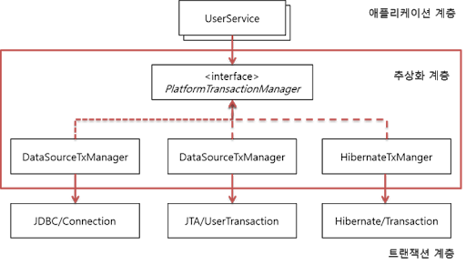

# Spring 에서 제공하는 Transaction 기능

## Spring은 트랜잭션과 관련된 3가지 핵심 기술을 제공하고 있다. 그 3가지 핵심 기술은 다음과 같다.

1. 트랜잭션(Transaction) 동기화
2. 트랜잭션(Transaction)추상화
3. AOP를 이용한 트랜잭션(Transaction) 분리

## 1. 트랜잭션(Transaction) 동기화

트랜잭션 동기화는 트랜잭션을 시작하기 위한 Connection 객체를 특별한 저장소에 보관해두고 필요할 때 꺼내쓸 수 있도록 하는 기술이다.
트랜잭션 동기화 저장소는 작업 쓰레드마다 Connection 객체를 독립적으로 관리하기 때문에, 멀티쓰레드 환경에서도 충돌이 발생할 여지가 없다.
그래서 다음과 같이 트랜잭션 동기화를 적용하게 된다.

## 2. 트랜잭션(Transaction)추상화

Spring은 트랜잭션 기술의 공통점을 담은 트랜잭션 추상화 기술을 제공하고 있다.
이를 이용함으로써 애플리케이션에 각 기술마다(JDBC, JPA, Hibernate 등) 종속적인 코드를 이용하지 않고도 일관되게 트랜잭션을 처리할 수 있도록 해주고 있다.

## 3. AOP를 이용한 트랜잭션(Transaction) 분리

AOP를 적용한 트랜잭션 어노테이션(@Transactional)을 지원

### Ref

* https://mangkyu.tistory.com/154
