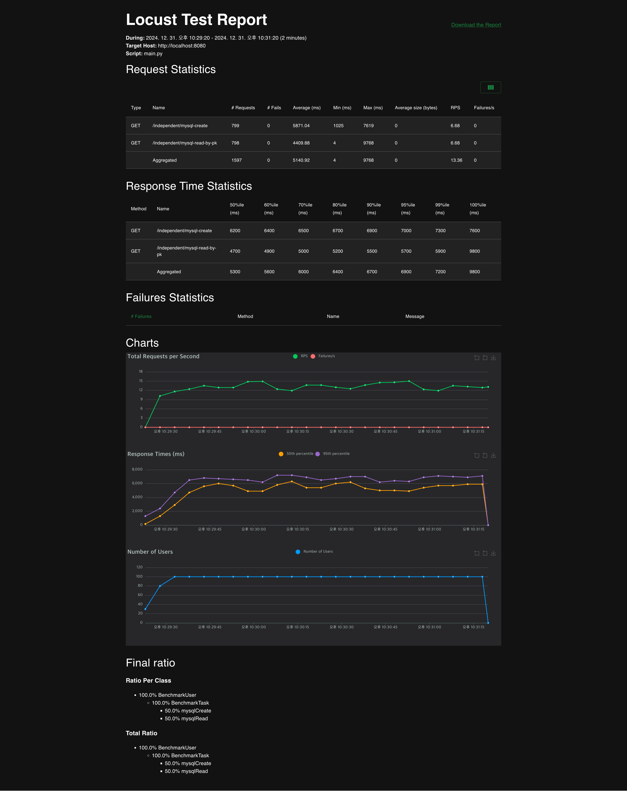
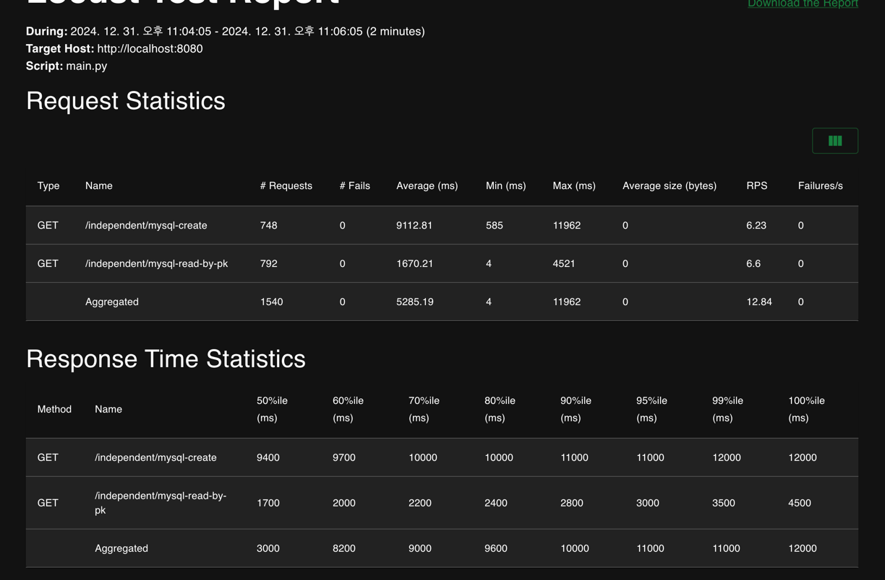
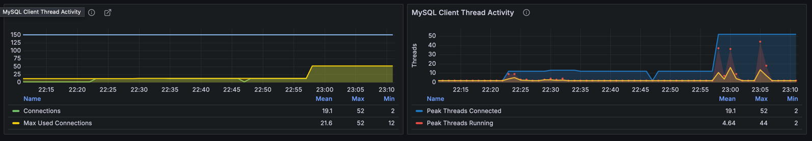
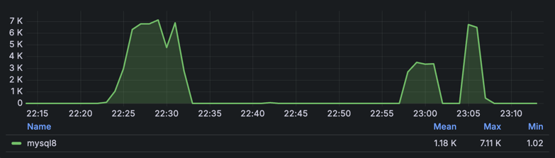
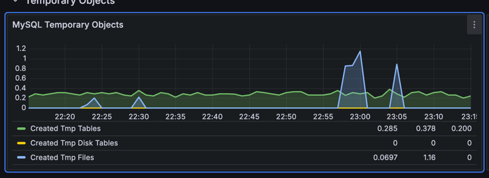
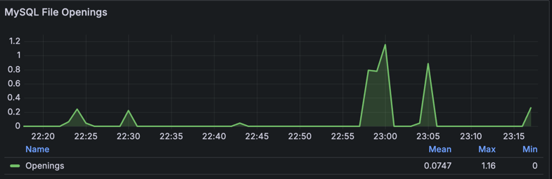
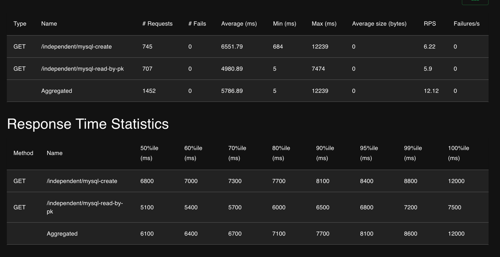
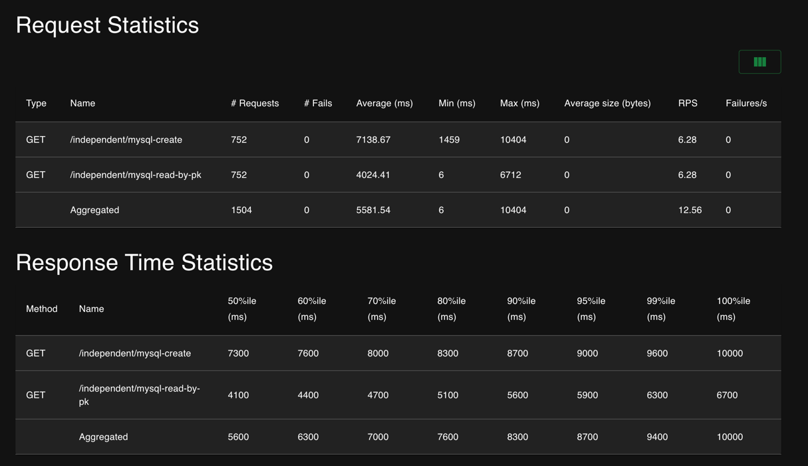

# Monitoring

## 1000개 삽입 + pk 조회 하는 API 동시 요청 테스트시 (10:29 ~ 10:31)

일해라 핫산

단순히 connection pool 사이즈로 connection 사용하고 반납 되기 전까지는
wait 하느라 단순 pk 조회 api도 대기 시간이 길어지는 것으로 보임.

그렇다면? connection-pool을 늘린다면 좋아지지 않을까?

## maximum-pool-size: 50 + minimum-idle: 10 설정을 함 (11:04 ~ 11:06)

조회는 빨라지고 삽입은 느려지는 현상이 되었다. 스프링의 풀 사이즈를 조정하면서 나의 작고 소중한 MySQL의 컨넥션 수가 증가 되었다.

QPS Peek 는 조금 떨어졌다. 이건 MySQL의 자원의 한계로 보인다.

삽입과 PK 조회인데 임시 파일이 증가했다.
인덱스도 안걸려 있고 GroupBy나 OrderBy 조회 아니고 단순 PK 조회에서 발생했을리는 만무해서
삽입에서 발생하나 찾아보니 반복 삽입에서 버퍼 크기를 초과하여 그럴수 있다고 한다.

## 단순히 컨넥션 풀을 늘린다고 해결되지 않는다 역시 돈질 해서 스펙 좋게 하는것만한게 없나 보다.

라고 생각하지만 그래도 설정값 변경으로 호전이 되나 해서 변경해본다.

뭐 좋아진것도 없었음. 역시 현질이 답인가?

## 컨넥션 풀과 설정값 변경한거로 테스트 해봤는데

별 차이 없었음

크게 차이는 없지만 그나마 제일 좋았던게 풀사이즈만 변경 했던게 RPS가 가장 높았다.
흠... 너무 단순한 테스트라 크게 차이가 없는거일수도?

조회랑 해봐도 크게 차이가 없넹
