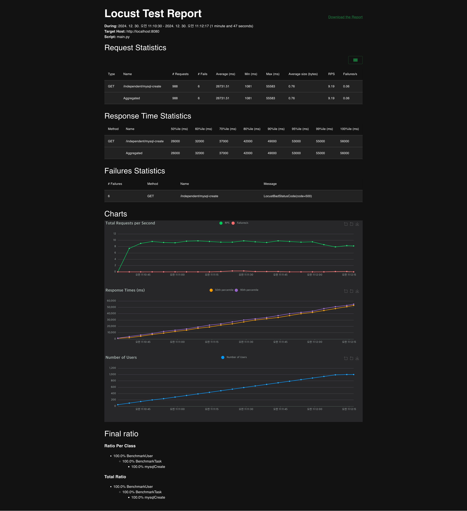
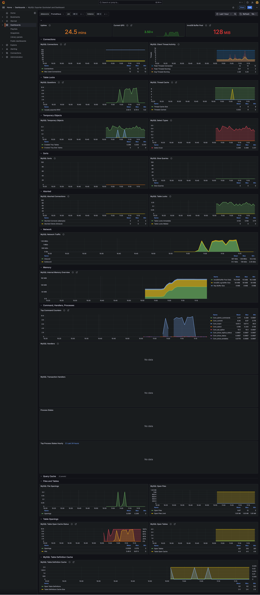

# Monitoring

삽입 중 에러도 발생했고 엄청 느림 2분에 1000개 요청을 처리 못함




## 2 Core + 4GB RAM 가정하고 MySQL 설정값 변경

다른 테스트에 영향을 끼치는 것도 귀찮으니 편의를 위해서 my.cnf 안하고 쿼리로 실행.
(다른 테스트시에는 재시작 필요)

```sql
SET GLOBAL innodb_buffer_pool_size = 1288490188;
# SET GLOBAL innodb_log_file_size = 536870912; read only 로 my.cnf 가능
SET GLOBAL innodb_log_buffer_size = 8388608;

SET GLOBAL innodb_thread_concurrency = 4;
SET GLOBAL innodb_io_capacity = 200;
```