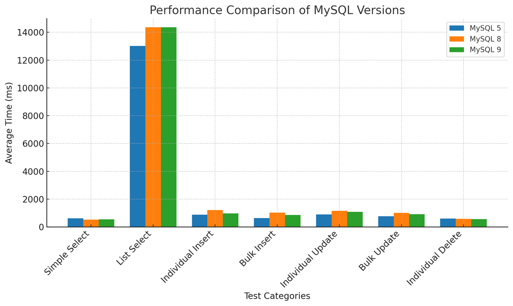

# DB-Performance

DB 성능 관련 측정 목적의 프로젝트.

## Database Setup

각 데이터베이스는 아래 이미지 사용

* MySQL 5: `image: mysql:5.7`
* MySQL 8: `image: mysql:8.4`
* MySQL 9: `image: mysql:9.1`
* PostgreSQL: `image: postgres:17.2`
* MongoDB: `image: mongo:7.`

## Test Environment

* Mac M1 pro, 32GB RAM
* Docker resource: 2 Core, 6GB RAM

# MySQL Only

* Simple Select: 단건 조회
    * MySQL 5: Times: [982, 585, 632, 628, 550, 561, 632, 543, 533, 541, 598, 665, 524, 578, 537, 673, 660, 681, 566, 578], Average: 612.35 ms
    * MySQL 8: Times: [516, 437, 542, 474, 611, 528, 497, 496, 474, 538, 469, 625, 668, 745, 538, 556, 444, 523, 448, 431], Average: 528.0 ms
    * MySQL 9: Times: [433, 427, 434, 637, 603, 507, 548, 534, 524, 527, 457, 680, 704, 703, 556, 517, 515, 484, 525, 696], Average: 550.55 ms

* List Select: 리스트 조회 (Limit 10 Offset 10)
    * MySQL 5: Times: [13343, 12952, 12784, 13001, 13252, 13034, 13091, 12913, 12936, 13091, 12969, 13084, 12946, 12925, 12859, 12840, 13081, 13098, 13149, 13071], Average: 13020.95 ms
    * MySQL 8: Times: [14039, 14320, 14527, 14125, 14393, 14357, 14559, 14724, 14222, 14538, 14427, 14412, 14172, 14339, 14147, 14068, 14361, 14329, 14701, 14473], Average: 14361.65 ms
    * MySQL 9: Times: [14770, 14381, 14246, 14162, 14499, 14471, 14488, 14376, 14437, 14504, 14243, 14205, 14350, 14262, 14457, 14212, 14259, 14299, 14308, 14320], Average: 14362.45 ms

* Individual Insert: 개별 삽입
    * MySQL 5: Times: [781, 778, 804, 895, 764, 816, 848, 1019, 987, 1011, 930, 881, 835, 951, 808, 996, 925, 895, 988, 815], Average: 886.35 ms
    * MySQL 8: Times: [1249, 1253, 1031, 1413, 1148, 1552, 1180, 1231, 1184, 1059, 1176, 1211, 1245, 1184, 1224, 1220, 1191, 1190, 1030, 1138], Average: 1205.45 ms
    * MySQL 9: Times: [1111, 1141, 1149, 1008, 1027, 1187, 971, 859, 733, 932, 917, 946, 945, 1060, 936, 796, 913, 813, 1049, 929], Average: 971.1 ms

* Bulk Insert: BatchSize 만큼 삽입
    * MySQL 5: Times: [613, 736, 585, 770, 620, 640, 604, 559, 683, 803, 523, 764, 528, 611, 705, 586, 520, 643, 579, 518], Average: 629.5 ms
    * MySQL 8: Times: [934, 1252, 909, 1050, 953, 924, 907, 964, 813, 852, 902, 1479, 1319, 1146, 975, 902, 1099, 957, 1034, 1016], Average: 1019.35 ms
    * MySQL 9: Times: [904, 957, 882, 757, 954, 986, 853, 973, 814, 890, 928, 720, 775, 763, 866, 865, 875, 775, 857, 779], Average: 858.65 ms

* Individual Update: 단건 수정
    * MySQL 5: Times: [873, 946, 823, 911, 1139, 882, 1143, 961, 970, 936, 861, 899, 1020, 686, 874, 898, 925, 706, 657, 870], Average: 899.0 ms
    * MySQL 8: Times: [1235, 1112, 1168, 1164, 1141, 1131, 1189, 1157, 1254, 1129, 1184, 1177, 1130, 1138, 1131, 1278, 1162, 1175, 1216, 1048], Average: 1165.95 ms
    * MySQL 9: Times: [1048, 1092, 1070, 1089, 1060, 1058, 1153, 1069, 1084, 1108, 1073, 1068, 1075, 1136, 1048, 1087, 1094, 1143, 1080, 1069], Average: 1085.2 ms

* Bulk Update: BatchSize 만큼 수정
    * MySQL 5: Times: [843, 796, 712, 596, 647, 945, 868, 766, 837, 853, 864, 791, 866, 664, 672, 604, 589, 735, 766, 764], Average: 758.9 ms
    * MySQL 8: Times: [837, 947, 1049, 1090, 893, 965, 1036, 1106, 982, 1035, 949, 893, 1044, 1062, 1089, 1022, 939, 1025, 1227, 1073], Average: 1013.15 ms
    * MySQL 9: Times: [1310, 1141, 1240, 1066, 1068, 824, 1003, 1118, 820, 835, 783, 287, 958, 941, 938, 902, 460, 860, 843, 806], Average: 910.15 ms

* Individual Delete: 단건 삭제
    * MySQL 5: Times: [1262, 508, 522, 468, 585, 548, 585, 557, 602, 576, 536, 478, 545, 631, 707, 600, 567, 607, 461, 448], Average: 589.65 ms
    * MySQL 8: Times: [1203, 560, 542, 547, 466, 540, 572, 578, 552, 561, 559, 552, 547, 573, 557, 546, 514, 542, 527, 518], Average: 577.8 ms
    * MySQL 9: Times: [1076, 553, 594, 565, 351, 398, 560, 571, 543, 574, 534, 537, 541, 524, 534, 468, 507, 522, 530, 666], Average: 557.4 ms

# DB Vendor

# JDBC vs JPA
