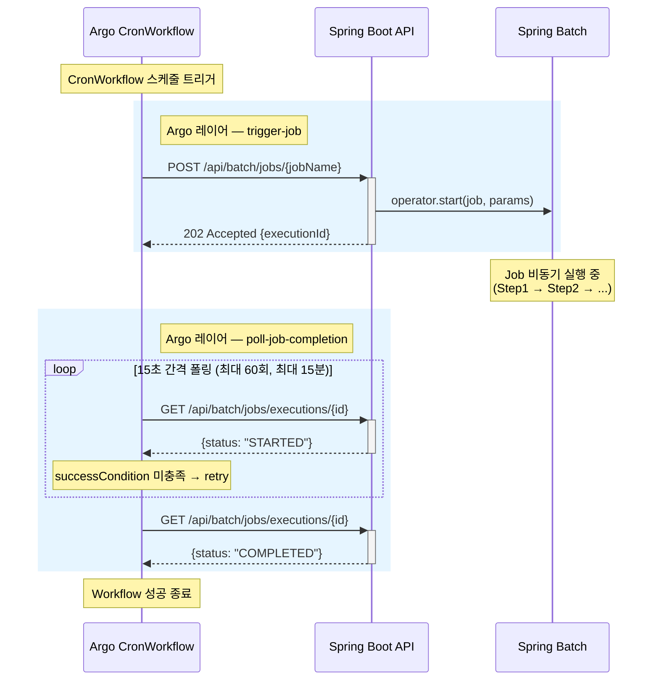
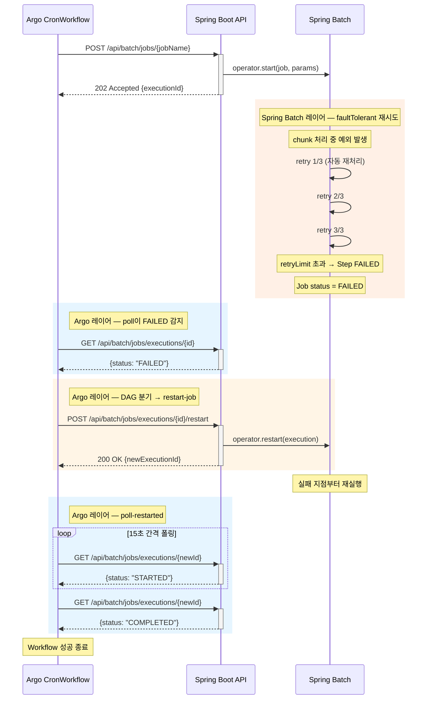
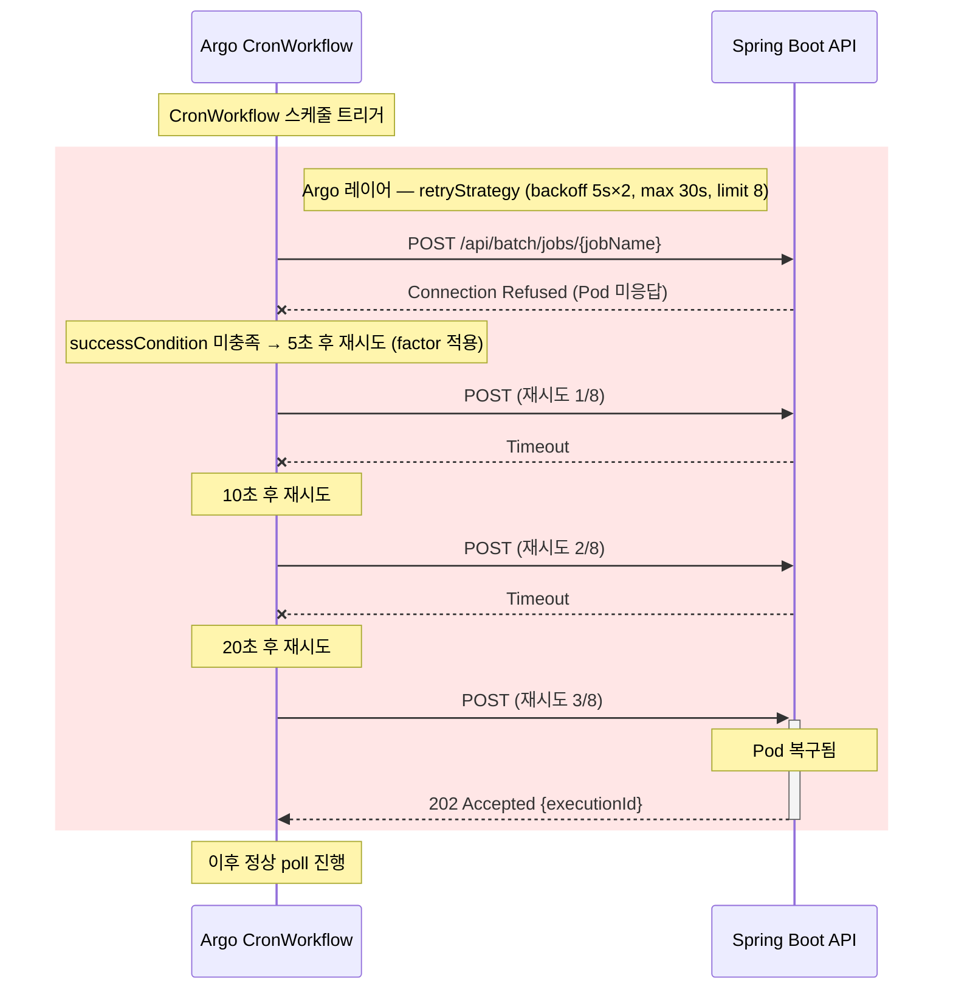
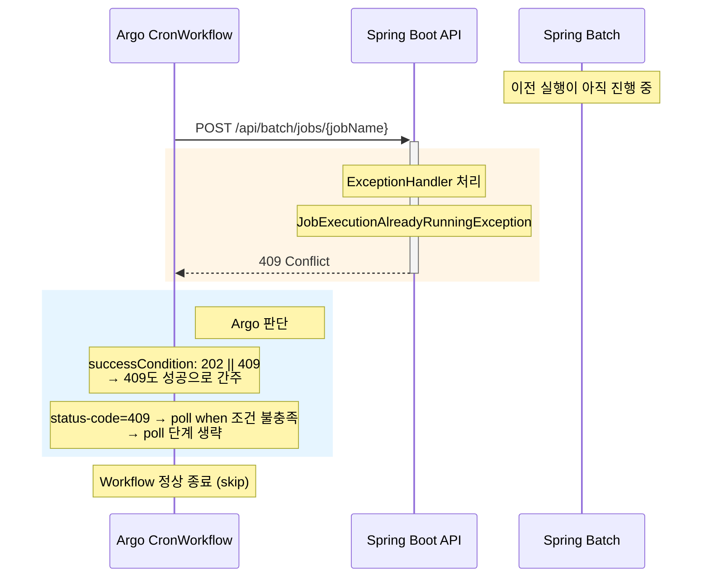
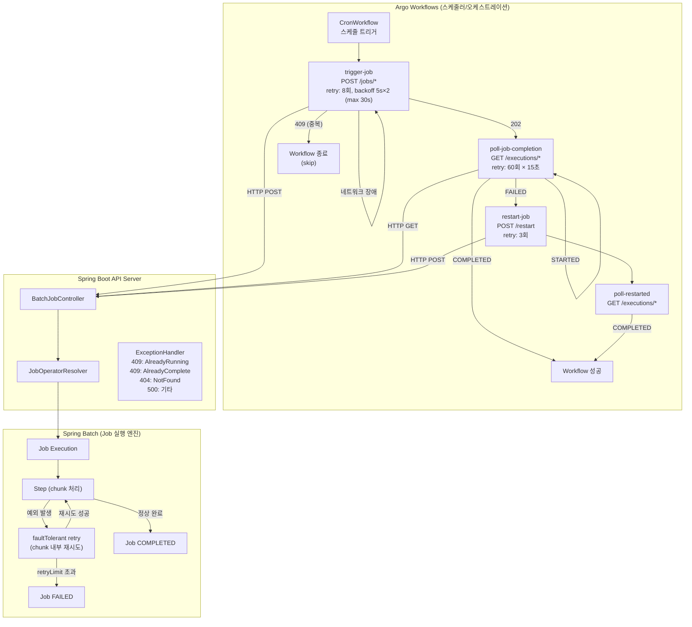

# Architecture Overview

## 전체 아키텍처

```
┌─────────────────────────────────────────────────────────────────────────┐
│                        Argo Workflows (K8s)                             │
│                                                                         │
│  ┌──────────────────┐  ┌──────────────────┐  ┌───────────────────────┐  │
│  │ simple-job-cron  │  │ failable-job-cron│  │long-running-job-cron  │  │
│  │  */2 * * * *     │  │  */5 * * * *     │  │  */10 * * * *         │  │
│  └───────┬──────────┘  └───────┬──────────┘  └──────────┬────────────┘  │
│          │                     │                        │               │
│          ▼                     ▼                        ▼               │
│  ┌─────────────────────────────────────────────────────────────────┐    │
│  │              batch-common (WorkflowTemplate)                    │    │
│  │  ┌──────────────┐  ┌────────────────────┐  ┌──────────────┐     │    │
│  │  │ trigger-job  │  │ poll-job-completion│  │ restart-job  │     │    │
│  │  │ POST /jobs/* │  │ GET /executions/*  │  │ POST restart │     │    │
│  │  │ retry: 8     │  │ retry: 60 (poll)   │  │ retry: 3     │     │    │
│  │  └──────────────┘  └────────────────────┘  └──────────────┘     │    │
│  └─────────────────────────────────────────────────────────────────┘    │
│                            │  HTTP                                      │
└────────────────────────────┼────────────────────────────────────────────┘
                             ▼
┌─────────────────────────────────────────────────────────────────────────┐
│                  Spring Batch API Server (Pod)                          │
│                                                                         │
│  ┌─────────────────────────────────────────────────────────────────┐    │
│  │                    BatchJobController                           │    │
│  │  POST /api/batch/jobs/{jobName}         → 202 (launch)          │    │
│  │  GET  /api/batch/jobs/executions/{id}   → 200 (status)          │    │
│  │  POST /api/batch/jobs/executions/{id}/stop    → 200             │    │
│  │  POST /api/batch/jobs/executions/{id}/restart → 200             │    │
│  └──────────────────────────┬──────────────────────────────────────┘    │
│                              │                                          │
│  ┌───────────────────────────▼─────────────────────────────────────┐    │
│  │                    JobOperatorResolver                          │    │
│  │          ┌─────────────────┬───────────────────┐                │    │
│  │          ▼                 ▼                   ▼                │    │
│  │  @HeavyJob?          heavyJobOperator    lightJobOperator       │    │
│  │  ─────────           (core:3, max:5)     (core:5, max:10)       │    │
│  │  failableJob → heavy                                            │    │
│  │  그 외      → light                                              │    │
│  └─────────────────────────────────────────────────────────────────┘    │
│                              │                                          │
│  ┌───────────────────────────▼─────────────────────────────────────┐    │
│  │                      Batch Jobs                                 │    │
│  │                                                                 │    │
│  │  ┌─────────────┐  ┌──────────────┐  ┌────────────────────┐      │    │
│  │  │  simpleJob  │  │ failableJob  │  │  longRunningJob    │      │    │
│  │  │  (light)    │  │  (heavy)     │  │  (light)           │      │    │
│  │  └─────────────┘  └──────────────┘  └────────────────────┘      │    │
│  └─────────────────────────────────────────────────────────────────┘    │
└─────────────────────────────────────────────────────────────────────────┘
```

---

## 시나리오별 DAG 흐름

### 1. simpleJob — 기본 실행

| 항목       | 내용                                                       |
|----------|----------------------------------------------------------|
| Steps    | `simpleJobSimpleStep` (5초) → `simpleJobAnotherStep` (1초) |
| Params   | `{ period, params: { message, count } }`                 |
| Operator | light (core:5, max:10)                                   |
| Cron     | `*/2 * * * *` (2분 간격)                                    |
| Argo 리소스 | `simple-job-cron.yaml`, `simple-job-workflow.yaml`       |

### 2. failableJob — 실패 + 자동 재시작

| 항목       | 내용                                                     |
|----------|--------------------------------------------------------|
| Steps    | `failableJobStep` (chunk=2, retryLimit=3)              |
| 구조       | Reader → Processor (`shouldFail=true` 시 예외) → Writer   |
| Params   | `{ shouldFail }`                                       |
| Operator | heavy (core:3, max:5) — `@HeavyJob`                    |
| Cron     | `*/5 * * * *` (5분 간격)                                  |
| Argo 리소스 | `failable-job-cron.yaml`, `failable-job-workflow.yaml` |

### 3. longRunningJob — 장시간 실행

| 항목       | 내용                                |
|----------|-----------------------------------|
| Steps    | `longRunningJobStep` (500초 sleep) |
| Params   | 없음                                |
| Operator | light (core:5, max:10)            |
| Cron     | `*/10 * * * *` (10분 간격)           |
| Argo 리소스 | `long-running-job-cron.yaml`      |

---

## 시나리오별 상세 플로우

### A. 정상 실행 흐름



### B. Spring Batch 내부 재시도 → 실패 → Argo 재시작



### C. 네트워크/인프라 장애 (trigger 실패 → Argo 재시도)



### D. 중복 실행 방지 (409 Conflict)



---

## 재시도/장애 전달 요약



### 레이어별 재시도/장애 전달 요약표

| 장애 유형           | 발생 위치                     | 처리 주체                          | 동작                                    |
|-----------------|---------------------------|--------------------------------|---------------------------------------|
| 네트워크 장애         | Argo → API 서버 (trigger)   | Argo retryStrategy             | 최대 8회, backoff 5s×2 (max 30s, ~185s)  |
| 중복 실행           | API 서버 (ExceptionHandler) | Spring → 409, Argo → poll 생략   | Workflow 정상 종료                        |
| 비즈니스 예외 (chunk) | Spring Batch (Step 내부)    | Batch faultTolerant            | chunk 내부 retry (retryLimit=3)         |
| Step 최종 실패      | Spring Batch (retry 소진)   | Batch → FAILED, Argo → restart | DAG 분기로 restart                       |
| Poll 타임아웃       | Argo (poll 단계)            | Argo retryStrategy             | 60회 × 10초 = 10분, 초과 시 Workflow Failed |
| API 서버 500      | API 서버 (예기치 못한 에러)        | Argo retryStrategy             | trigger 8회 재시도 / poll 1회 소모           |

---

## 공통 메커니즘

| 구성 요소                         | 역할                                                     |
|-------------------------------|--------------------------------------------------------|
| **batch-common**              | 재사용 WorkflowTemplate. trigger/poll/restart 3개 HTTP 템플릿 |
| **trigger-job**               | Job 실행 → 202(성공) or 409(중복 스킵)                         |
| **poll-job-completion**       | 10초 간격 폴링, `retryStrategy`로 polling loop 구현            |
| **restart-job**               | FAILED 시 재시작, 새 executionId 반환                         |
| **JobOperatorResolver**       | `@HeavyJob` 어노테이션 기반으로 heavy/light 스레드풀 분기             |
| **concurrencyPolicy: Forbid** | 모든 CronWorkflow에서 이전 실행 중이면 새 실행 건너뜀                   |

## API 엔드포인트

| Method | Path                                      | 응답  | 설명            |
|--------|-------------------------------------------|-----|---------------|
| GET    | `/api/batch/jobs`                         | 200 | 등록된 Job 목록 조회 |
| POST   | `/api/batch/jobs/{jobName}`               | 202 | Job 비동기 실행    |
| GET    | `/api/batch/jobs/executions/{id}`         | 200 | 실행 상태 조회      |
| POST   | `/api/batch/jobs/executions/{id}/stop`    | 200 | 실행 중지 요청      |
| POST   | `/api/batch/jobs/executions/{id}/restart` | 200 | 실패한 Job 재시작   |
