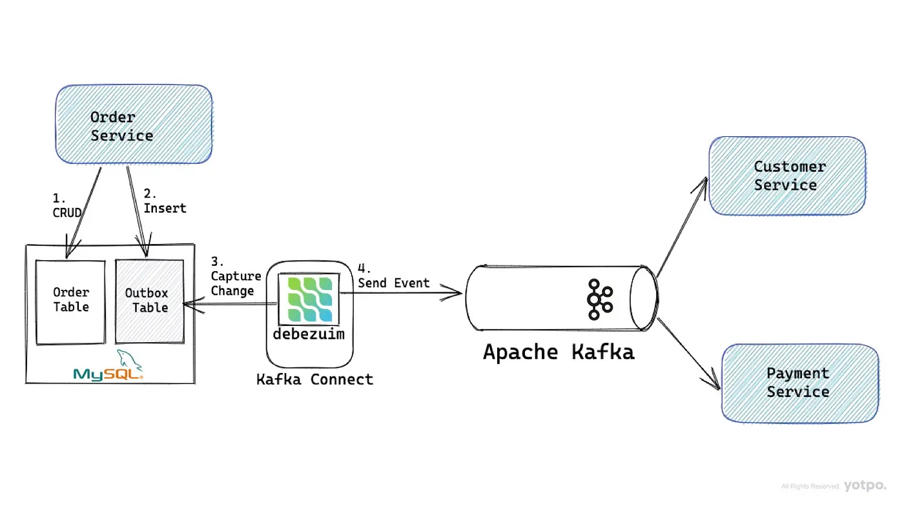

# Transactional Outbox Pattern

# Install

## Add connector

```shell
cd docker
docker compose up -d 
.script/create_connector.sh
```

# Description



## Ref

* https://medium.com/yotpoengineering/outbox-with-debezium-and-kafka-the-hidden-challenges-998c00487ae4
* https://debezium.io/documentation/reference/stable/transformations/outbox-event-router.html
* https://github.com/debezium/debezium-examples/tree/main/outbox
* https://www.youtube.com/watch?v=uk5fRLUsBfk&list=WL&index=3&t=1986s
* https://velog.io/@eastperson/Transaction-Outbox-Pattern-%EC%95%8C%EC%95%84%EB%B3%B4%EA%B8%B0